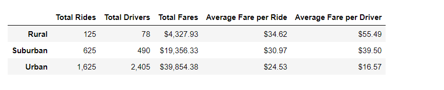

# PyBer_Analysis
##### PyBer Analysis Performed with MatPlotLib using Pandas in Jupyter Notebook
##### Jupyter Notebook Files: [PyBer_Challenge.ipynb](PyBer_Challenge.ipynb)
##### Data Sources: [city_data.csv](Resources/city_data.csv), [PyBer_ride_data.csv](Resources/PyBer_ride_data.csv), [ride_data.csv](Resources/ride_data.csv)
---
## Analysis Overview:
The purpose of this analysis was to analyze the given data on ride sharing to see how the data differs between each city type, Urban, Rural, and Suburban. Using MatPlotLib with Pandas in Jupyter Notebook, a dataframe was created to summarize the "Total Rides", "Total Drivers", "Total Fares", "Average Fare per Ride", and the "Average Fare per Driver". Then with the information gathered, a multiple line chart was created to see how each city types data differs from one another. This data will help executives at PyBer to make future company decisions.

---
## Results:
Using the MatPlotLib method along with DataFrame and filtering methods, dataframes and cahrts were created to better understand the data. 

- DataFrame: Here we can see the Urban city type is generating the highest Total Rides, Total Drivers, and Total Fares than any other city type. However, the Average Fare per Ride is less than both Rural and Suburban. This suggests that the rides are shorter, resulting in a lower Average Fare per Driver. We can also see that the Rural city type has the highest Average Fare per Ride and Average Fare per Driver. This makes sense because most Rural areas are spread out over farther distances. This also coorelates with lower population, lower Total Rides, and Total Drivers.

- Multiple-Line Chart: This line chart provides a wonderful visualization of what is happening in these different city types based on Total Fare. As you can see, the Total Fare for the Urban city type is by far the highest, with Suburban second highest, and the Rural the lowest. This correlates with the above dataframe and given the information, Urban drivers are making more money overall because they are given more Total Ride opportunities.

---
## Summary
After close analysis of the PyBer ride sharing data, we can determine highlight a few key findings.
1. Urban: Highest Total Rides, Highest Total Drivers, Highest Total Fares, Lowest Average Fare per Ride, and Lowest Average Fare per Driver
2. Suburban: Middle performance on all measurements
3. Rural: Lowest Total Rides, Lowest Total Drivers, Lowest Total Fares, Highest Average Fare per Ride, and Highest Average Fare per Driver.
4. The Urban city type has the most opportunity for growth and given the Total Fare by City Type analysis, we can see that the Urban city type provides the biggest revenue opportunity. There are more drivers and more rides, which means they have the highest demand for rides.
5. Due to the low demand in Rural areas, this city type would be less advantageous to invest in because of the low Total Drivers and Low Total Rides.

This analysis could benefit from a closer look into an enitre year of data. With only three months of data, this doesn't provide enough information as we don't know how seasonality effects the ride data. If we also had demographic information, this might effect the ride performance for particular areas.

To increase the performance across the board, incentives could be offered to both parties as a way to get them to try PyBer ride share, whether they are a driver or rider. Ultimately, we would expect an increase in increase revenues, brand awareness, and maintain customer loyalty across all city types.